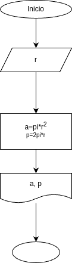

# area_perimetro_circulo
programa en python para calcular el area y el perimetro de un circulo , dado su radio

 ## Análisis

 ### Variables de entrada
- r: radio del circulo

### Procesamiento
- a: area del ciculo
- p: perimetro del ciculo

$a = \pi*r²$
$p = 2*\pi*r$

 ## Diseño

 ## Construcción
 - codigo implementado en el archivo area_perimetro_circulo.py
 
